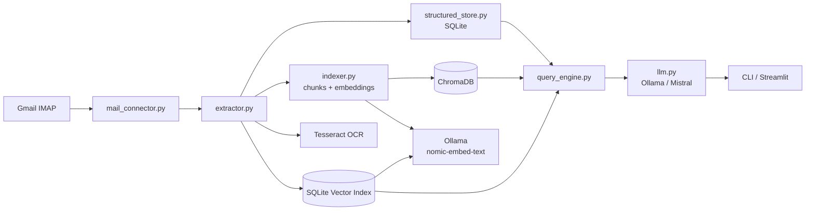

# Mail IA Agent (Gmail, local-first)

Ce projet Python indexe des emails Gmail et leurs pieces jointes pour permettre des recherches locales. Le fonctionnement de reference est le mode safe SQLite-only. Le chemin Chroma/Ollama reste disponible mais il est volontairement considere comme optionnel et experimental sur cette machine.

Important:
- le mode safe n'est plus une simple recherche naive: il repose sur un index full-text SQLite FTS5 local
- cet index est maintenu automatiquement quand les mails sont synchronisés

Alternative a ChromaDB si vous cherchez surtout la stabilité:
- SQLite FTS5 pour la recherche lexicale locale, très simple et robuste.
- SQLite-vector (nouveau backend du projet) pour stocker les embeddings Ollama directement en SQLite, sans Chroma.
- FAISS pour un index vectoriel local léger, si vous acceptez une gestion manuelle de la persistance.
- sqlite-vss pour rester dans l'écosystème SQLite avec un moteur vectoriel embarqué.

En pratique, la meilleure option pour éviter les plantages ici reste SQLite FTS5 ou le mode safe actuel. Si vous devez tenter un hybride, utilisez d'abord le backend sqlite-vector avant de tester Chroma.

## Safe vs hybride experimental (important)

Le projet expose deux modes qui n'ont pas le meme objectif:

- `safe` (recommande):
  - utilise uniquement SQLite local (mails + FTS5)
  - n'utilise ni Chroma ni Ollama
  - priorite a la stabilite machine
  - reponse locale factuelle (recherche + synthese)

- `hybride experimental`:
  - combine recherche semantique (embeddings) + LLM local
  - backend semantique possible: `sqlite-vector` ou `chroma`
  - meilleur rappel semantique, mais charge CPU/RAM/IO plus elevee
  - peut encore provoquer des plantages sur machine limite

Resume pratique:
- usage quotidien: `safe`
- tests avances ponctuels: `hybride experimental` avec `sqlite-vector` en premier

Regle d'execution stricte dans l'interface:
- si `Mode de reponse = hybride experimental` et `Backend hybride = sqlite-vector`, alors la requete hybride est executee avec `sqlite-vector`
- si `Mode de reponse = hybride experimental` et `Backend hybride = chroma`, alors la requete hybride est executee avec `chroma`
- l'interface affiche le backend selectionne, puis la `Derniere execution: hybride + <backend>`
- en cas d'erreur, le message inclut explicitement `backend=<valeur>` pour identifier la source du plantage

Comportement de l'onglet `Question`:
- en mode `safe`, la question se saisit dans l'onglet `Question` et la recherche se relance automatiquement a la touche `Entree`
- en mode `hybride experimental`, l'execution se fait via le bouton `Interroger en mode hybride` (pas d'auto-run)
- en haut de l'onglet, l'UI affiche le backend actif/selectionne pour que la source d'un crash soit visible immediatement

## Pourquoi sqlite-vector peut aussi planter

`sqlite-vector` reduit la complexite par rapport a Chroma, mais il ne supprime pas la cause principale des crashs: la charge locale Ollama + embeddings + generation.

Sur une machine contrainte, ces facteurs peuvent provoquer une instabilite:
- saturation RAM/CPU quand l'indexation semantique et la generation LLM se chevauchent
- stockage local tres sollicite (base SQLite + chunks + logs)
- modele trop lourd pour les ressources disponibles
- trop de mails traites en une seule passe

Donc: `sqlite-vector` est generalement plus stable que `chroma` ici, mais pas garanti 100% stable.

## Plan anti-plantage recommande

Appliquer ces regles dans cet ordre:

1. Rester en `safe` pour la production locale.
2. Pour un test hybride, utiliser seulement `sqlite-vector` (eviter `chroma`).
3. Reduire la taille des lots IMAP pendant les sync:

```powershell
setx IMAP_FETCH_BATCH_SIZE 50
```

4. Reduire le volume teste (ex: 20 a 50 mails d'abord):

```powershell
C:/Users/karap/anaconda3/envs/LLMRag/python.exe -m src.cli sync --folder INBOX --limit 30
```

5. Verifier qu'Ollama repond avant un test hybride:

```powershell
ollama list
ollama run mistral "ping"
```

6. Si une instabilite apparait, revenir immediatement au mode `safe`.

## Solution concrete si hybride plante encore

Oui: la solution robuste est de separer les usages.

- `safe` pour toutes les questions courantes (fiable, deja suffisant dans la plupart des cas)
- `hybride experimental` seulement en session courte de test
- backend prefere: `sqlite-vector`
- ne pas lancer de grosses sync en meme temps qu'une requete hybride

Si meme `sqlite-vector` plante regulierement sur cette machine, considerez l'hybride comme non supporte localement et gardez `safe` comme mode de reference.

## Architecture globale

L'architecture du projet suit un pipeline local de bout en bout. Le connecteur IMAP lit les mails Gmail et leurs metadonnees, puis le module d'extraction transforme le contenu des pieces jointes (PDF, DOCX, images OCR) en texte exploitable. Par défaut, ce contenu alimente uniquement la couche structuree SQLite. La couche vectorielle ChromaDB et le moteur Ollama ne sont utilisés que si on les active explicitement, car ils ont déjà provoque des coupures brutales sur cette machine.



SQLite joue le role de colonne vertebrale factuelle du systeme. La base stocke des informations explicites et verifiables comme la date, l'expediteur, le sujet, le corps normalise, les pieces jointes et, ensuite, les entites extraites (montants, personnes, themes). Cette couche permet des filtres exacts, des tris temporels, des agregations et des tableaux, ce qui est indispensable pour repondre de maniere fiable aux questions metier sans hallucination.

En mode safe, le moteur de requete s'appuie uniquement sur SQLite. Cela suffit pour des requetes du type « derniers mails », « offres d'emploi des quinze derniers jours », « mails de tel expediteur », ou « synthese des sujets les plus recents ». Le chemin hybride peut apporter plus de rappel semantique, mais il n'est pas le comportement de reference ici.

En pratique, le flux complet est le suivant: Gmail IMAP alimente `mail_connector.py`, l'analyse de contenu passe par `extractor.py`, les faits sont persistes par `structured_store.py`, puis `query_engine.py` orchestre une reponse locale safe uniquement a partir de SQLite. Les actions de maintenance sont isolees dans `actions.py`, et la CLI expose les commandes `ask`, `archive` et `delete` avant l'interface Streamlit.

## Choix retenus

Le projet a maintenant un choix clair de reference:

- Mode retenu: SQLite-only, safe, sans dépendance à Chroma/Ollama pour les usages courants.
- Interfaces retenues: CLI `mailia`, commande Streamlit locale, tests de validation en lecture SQLite.
- Limite de volume: jusqu'à `10000` messages, mais en pratique il vaut mieux commencer plus bas et monter progressivement.

Options encore possibles mais non retenues par défaut sur cette machine:

- ChromaDB pour le rappel sémantique.
- Ollama pour les embeddings et la génération LLM.
- Chemin `--no-safe`, explicitement experimental, à réserver à une machine plus robuste.

Pourquoi ce choix:

- la stabilité prime sur la complétude fonctionnelle;
- le mode hybride a déjà provoqué des coupures brutales du PC;
- le mode safe couvre déjà l'essentiel des usages pratiques: lecture, tri, recherche simple, consultation locale et Streamlit.

## Prealables (a faire avant le clone)

### 1) Ollama + modeles

Cette section est optionnelle sur cette machine. Elle sert seulement si vous souhaitez retester le chemin hybride Chroma/Ollama dans un environnement plus robuste.

1. Installer Ollama (Windows): https://ollama.com/download
2. Verifier:

```powershell
ollama --version
```

3. Telecharger les modeles:

```powershell
ollama pull mistral
ollama pull nomic-embed-text
```

4. Tester:

```powershell
ollama run mistral "dis bonjour"
```

Ollama tourne en local sur http://localhost:11434.

Recommandation de confort pour un usage hybride stable:
- CPU: 6 cœurs physiques ou plus
- RAM: 16 Go minimum, 32 Go recommandés
- Stockage: SSD NVMe, avec plusieurs gigaoctets libres pour les modèles et les index
- GPU: optionnel mais utile; 6 à 8 Go de VRAM aident nettement pour les modèles plus lourds
- Refroidissement: ne pas lancer le mode hybride sur une machine déjà chaude ou à l'arrêt thermique limite

### 2) Tesseract OCR (Windows)

1. Installer Tesseract (UB Mannheim): https://github.com/UB-Mannheim/tesseract/wiki
2. Pendant l'installation, ajouter la langue French.
3. Ajouter le dossier d'installation au PATH (souvent C:\Program Files\Tesseract-OCR).
4. Ouvrir un nouveau terminal puis verifier:

```powershell
tesseract --version
```

Si PATH n'est pas disponible, definir dans `.env`:

```env
TESSERACT_CMD=C:\Program Files\Tesseract-OCR\tesseract.exe
```

### 3) Backends semantiques hybrides (etape 5, optionnelle)

Deux backends hybrides sont disponibles:
- `sqlite-vector`: embeddings Ollama stockés dans SQLite (recommandé en premier test)
- `chroma`: backend historique, plus risqué sur cette machine

Dans les deux cas, il faut Ollama actif avec `nomic-embed-text`.

Si vous voulez éviter ChromaDB tout en gardant une recherche utile, privilégiez SQLite FTS5 ou sqlite-vector. Cela réduit la surface de panne tout en gardant un mode hybride possible.

Verification rapide:

```powershell
ollama list
```

Vous devez voir `nomic-embed-text:latest` dans la liste.

### 4) Ollama pour les reponses LLM (etapes 6-7, optionnel)

Le modele de langage local utilise par le wrapper LLM est `mistral` par defaut. Il doit apparaitre dans `ollama list`, et le service Ollama doit rester actif pendant les tests du moteur de requete. Cette étape n'est à tenter que si la machine est suffisamment dimensionnée et que le mode safe vous donne déjà le résultat fonctionnel attendu.

Verification rapide:

```powershell
ollama list
```

Vous devez voir `mistral:latest` dans la liste.

Regle generale d'execution:
- toutes les commandes de ce README doivent etre lancees dans l'environnement virtuel active (`.venv`).
- sur Windows, si besoin, utilisez explicitement `.\\.venv\\Scripts\\python.exe`.

Pourquoi installer Tesseract des le debut:
- l'etape 3 repose sur OCR (images/scans).
- sans Tesseract, le test OCR passe en `SKIP` et vous ne validez pas le round complet.
- l'installer avant le clone/les tests evite des allers-retours de configuration plus tard.

Etat actuel:
- setup du projet
- connexion IMAP Gmail
- commande CLI `index` pour afficher les derniers mails de INBOX en mode safe
- fetch IMAP par batch pour limiter les pics memoire sur gros volumes

Lancement rapide:

```bash
python.exe -m src.cli sync --folder INBOX --limit 50
python.exe -m src.cli ask "Résumé des dernières offres d'emplois sur les derniers quinze jours"
streamlit run app_streamlit.py
```

Si `streamlit` n'est pas dans le PATH:

```bash
python.exe -m streamlit run app_streamlit.py
```

Si le paquet local a été installé:

```bash
mailia-streamlit
```

## Lancer Streamlit en 60 secondes (interface simple)

Utilisez ces etapes exactes pour avoir une interface claire et compréhensible rapidement.

1. Ouvrir un terminal dans le dossier du projet.
2. Lancer Streamlit avec l'environnement recommande:

```powershell
C:/Users/karap/anaconda3/envs/LLMRag/python.exe -m streamlit run app_streamlit.py
```

3. Ouvrir l'URL locale affichee par Streamlit:

```text
http://localhost:8501
```

4. Dans l'interface, faire simplement:
- laisser `safe` active (mode recommande)
- ouvrir `Derniers mails` pour verifier les donnees
- ouvrir `Question`, poser une question en français

Parcours minimal conseille:
- `sync` d'abord pour alimenter SQLite
- puis Streamlit en mode safe
- hybrides seulement en test ponctuel

Commandes minimales:

```powershell
C:/Users/karap/anaconda3/envs/LLMRag/python.exe -m src.cli sync --folder INBOX --limit 50
C:/Users/karap/anaconda3/envs/LLMRag/python.exe -m streamlit run app_streamlit.py
```

Depannage rapide:
- si `streamlit` manque, installez les dependances:

```powershell
C:/Users/karap/anaconda3/envs/LLMRag/python.exe -m pip install -r requirements.txt
```

- si le port `8501` est occupe:

```powershell
C:/Users/karap/anaconda3/envs/LLMRag/python.exe -m streamlit run app_streamlit.py --server.port 8502
```

- si la machine devient instable en hybride: revenir immediatement au mode `safe`

## 0) Prérequis avant de cloner le repo

Logiciels a installer:
- Python 3.11+ (3.11 recommande)
- Git
- SQLite (CLI sqlite3 recommande pour verification locale)
- Tesseract OCR (pour l'etape OCR)
- Ollama (pour les etapes LLM/embeddings suivantes)

Verifications rapides:

```powershell
python --version
git --version
tesseract --version
sqlite3 --version
ollama --version
```

Parametrages Gmail a faire avant les tests IMAP:
1. Activer la validation en 2 etapes sur le compte Google.
2. Generer un mot de passe d'application Google.
3. Activer IMAP dans Gmail (Parametres > Transfert et POP/IMAP).

Important:
- Si `tesseract --version` echoue, ajoutez Tesseract au `PATH`.
- Alternative: renseigner `TESSERACT_CMD` dans `.env`.

## 1) Cloner le projet depuis GitHub

```bash
git clone https://github.com/PascalDuval/IAmail.git
cd IAmail
```

## 2) Creer un environnement Python

Windows (PowerShell):

```powershell
python -m venv .venv
.\.venv\Scripts\Activate.ps1
```

macOS / Linux:

```bash
python3 -m venv .venv
source .venv/bin/activate
```

## 3) Installer les dependances

Activez d'abord l'environnement virtuel (section 2), puis executez:

```bash
pip install -r requirements.txt
```

## 4) Configurer Gmail via mot de passe d'application

1. Activez la validation en 2 etapes du compte Google.
2. Generez un mot de passe d'application Gmail.
3. Activez IMAP dans Gmail (Parametres > Transfert et POP/IMAP).
4. Copiez `.env.example` vers `.env` puis renseignez vos valeurs.

Exemple:

```env
GMAIL_ADDRESS=votre_mail@gmail.com
GMAIL_APP_PASSWORD=votre_mot_de_passe_application
IMAP_HOST=imap.gmail.com
IMAP_PORT=993
IMAP_SSL=true
IMAP_SSL_VERIFY=true
IMAP_FOLDER=INBOX
IMAP_FETCH_BATCH_SIZE=200
LLM_MODEL=mistral
OLLAMA_HOST=http://localhost:11434
EMBEDDING_MODEL=nomic-embed-text
MAIL_AI_DB_PATH=data/mail_ai.db
CHROMA_PERSIST_DIR=data/chroma_db
```

Variables prises en charge:
- `GMAIL_ADDRESS`: adresse Gmail
- `GMAIL_APP_PASSWORD`: mot de passe d'application Google
- `IMAP_HOST`: serveur IMAP (Gmail: `imap.gmail.com`)
- `IMAP_PORT`: port IMAP (Gmail SSL: `993`)
- `IMAP_SSL`: `true` ou `false`
- `IMAP_SSL_VERIFY`: `true` ou `false` (laisser `true` sauf diagnostic local)
- `IMAP_FOLDER`: dossier a lire (par defaut `INBOX`)
- `IMAP_FETCH_BATCH_SIZE`: taille des lots IMAP pour limiter l'usage memoire (par defaut `200`)
- `LLM_MODEL`: modele de langage utilise pour la synthese des reponses (par defaut `mistral`)
- `OLLAMA_HOST`: endpoint Ollama local (par defaut `http://localhost:11434`)
- `EMBEDDING_MODEL`: modele d'embeddings utilise par Chroma (par defaut `nomic-embed-text`)
- `MAIL_AI_DB_PATH`: chemin de la base SQLite locale (par defaut `data/mail_ai.db`)
- `CHROMA_PERSIST_DIR`: dossier de persistence Chroma (par defaut `data/chroma_db`)

Important:
- ne committez jamais `.env`
- ne partagez jamais votre mot de passe d'application

## 5) Tests progressifs (rounds)

Important pour tous les rounds:
- lancer les commandes dans l'environnement virtuel active (`.venv`),
- ou utiliser le binaire explicite: `.\.venv\Scripts\python.exe ...`

### 5.1) Verifier la connexion IMAP (Round 1 / etape 1)

Commande de test:

```bash
python.exe -m src.cli index
```

Sortie attendue:
- tableau des derniers mails avec date, expediteur et objet

Exemple valide (Round 1):

```text
┌──────────────────┬───────────────────────────────────────────────────────────┬─────────────────────────────────────────────────────────────────────────────────────────────────────────────────────────┐
│ Date             │ Expediteur                                                │ Objet                                                                                                                   │
├──────────────────┼───────────────────────────────────────────────────────────┼─────────────────────────────────────────────────────────────────────────────────────────────────────────────────────────┤
│ 2026-07-12 11:34 │ Google <no-reply@accounts.google.com>                     │ Alerte de securite                                                                                                      │
│ 2026-07-12 11:17 │ Leader <noreply@communities.kajabimail.com>               │ Leader is live on SAATM Virtual Academy | July 12                                                                       │
│ 2026-07-12 11:01 │ Agone <editions@agone.org>                                │ Un 14 juillet, il y a 237 ans [LettrInfo 26-XXI]                                                                        │
│ 2026-07-12 10:50 │ Votre alerte Cadremploi <offres@alertes.cadremploi.fr>    │ 1 offre a ne rater sous aucun pretexte                                                                                  │
│ 2026-07-12 10:43 │ Alertes Google Scholar <scholaralerts-noreply@google.com> │ Nietzsche - de nouveaux resultats sont disponibles                                                                      │
│ 2026-07-12 10:43 │ Alertes Google Scholar <scholaralerts-noreply@google.com> │ "stanley cavell" - de nouveaux resultats sont disponibles                                                               │
│ 2026-07-12 10:15 │ Indeed <donotreply@match.indeed.com>                      │ Chef de Projet Supervision Transport Supervision Aide a l'Exploitation (SAE) MAV - F/H (D&I/TSI) - RATP EPIC          │
│ 2026-07-12 10:01 │ Indeed <donotreply@match.indeed.com>                      │ Responsable maitrise d'oeuvre outillage, telemaintenance et supervision pour le Grand Paris - F/H (DSI/TSI) - RATP EPIC │
│ 2026-07-12 09:49 │ Alertes LinkedIn Jobs <jobalerts-noreply@linkedin.com>    │ Blockchain / Cryptocurrency Project Lead [Full Stack and AWS] chez OREBiT                                               │
│ 2026-07-12 09:49 │ Alertes LinkedIn Jobs <jobalerts-noreply@linkedin.com>    │ Alternant(e) REDACTEUR ET CREATEUR DE CONTENUS VIDEOS chez Cite internationale universitaire de Paris                  │
└──────────────────┴───────────────────────────────────────────────────────────┴─────────────────────────────────────────────────────────────────────────────────────────────────────────────────────────┘
```

### 5.2) Etape 2 / Round 2 - mode safe pour gros volumes

Objectif:
- `index` recupere les metadonnees d'enveloppe et la taille brute du message, sans charger tous les corps en masse
- la table affiche la colonne `Taille brute (octets)`
- plage de limite CLI: `5` a `10000`

Commande de test Round 2 (20 derniers mails):

```bash
python.exe -m src.cli index --limit 20
```

Exemple de sortie Round 2:

```text
┌──────────────────┬───────────────────────────────────────────────────────────┬──────────────────────┬─────────────────────────────────────────────────────────────────────────────────────────────────────────────────────────────┐
│ Date             │ Expediteur                                                │ Taille brute (octets) │ Objet                                                                                                                      │
├──────────────────┼───────────────────────────────────────────────────────────┼──────────────────────┼─────────────────────────────────────────────────────────────────────────────────────────────────────────────────────────────┤
│ 2026-07-12 11:34 │ Google <no-reply@accounts.google.com>                     │                 26173 │ Alerte de securite                                                                                                         │
│ 2026-07-12 11:17 │ Leader <noreply@communities.kajabimail.com>               │                 29804 │ Leader is live on SAATM Virtual Academy | July 12                                                                          │
└──────────────────┴───────────────────────────────────────────────────────────┴──────────────────────┴─────────────────────────────────────────────────────────────────────────────────────────────────────────────────────────────┘
```

### 5.3) Etape 3 - extraction PDF / DOCX / OCR

Commande de test:

```bash
python.exe tests/run_extractor_examples.py
```

Sortie de reference:

```text
=== Round 3: extraction PDF / DOCX / OCR ===
[OK] DOCX: contient 'Bonjour depuis DOCX'
[OK] PDF: contient 'Bonjour PDF exemple'
[OK] OCR: contient 'OCR'
Round 3 OK: extraction PDF/DOCX/OCR validee.
```

Pourquoi le `SKIP` OCR peut apparaitre:
- Tesseract n'est pas installe sur la machine
- Tesseract est installe, mais son executable n'est pas dans le `PATH`
- le chemin n'est pas renseigne dans la variable `TESSERACT_CMD`

Installation Tesseract (Windows):
1. Installer Tesseract (par exemple UB Mannheim).
2. Verifier dans un terminal:

```powershell
tesseract --version
```

3. Si la commande n'est pas trouvee, ajouter le dossier d'installation de Tesseract au `PATH`.
4. Alternative locale projet: renseigner `TESSERACT_CMD` dans `.env`, par exemple:

```env
TESSERACT_CMD=C:\Program Files\Tesseract-OCR\tesseract.exe
```

### 5.4) Etape 4 - stockage structure SQLite

Objectif:
- creer un schema SQLite (`mails`, `attachments`, `entities`)
- valider insertion et lecture

Commande de test:

```bash
python.exe tests/run_structured_store_examples.py
```

Sortie attendue (exemple):

```text
[OK] schema contient mails
[OK] schema contient attachments
[OK] schema contient entities
[OK] lecture recent mails non vide
[OK] lecture sujet correct
[OK] lecture uid correct
Etape 4 OK: schema + insertion + lecture SQLite valides.
```

### 5.5) Etape 5 - indexation semantique Chroma (optionnelle)

Objectif:
- decouper le texte en chunks
- generer les embeddings via Ollama (`nomic-embed-text`)
- persister les chunks dans ChromaDB
- verifier une requete semantique simple

Note:
- cette étape reste expérimentale sur cette machine
- si elle provoque une coupure brutale, ne l'utilisez pas et restez en mode safe SQLite-only
- avant de l'activer, vérifiez que la machine peut absorber une charge soutenue sans chute de tension, sans surchauffe, et sans redémarrage WHEA ou Kernel-Power
- si vous ne cherchez pas à évaluer un moteur semantique, vous pouvez ignorer complètement cette étape

Commande de test:

```bash
python.exe tests/run_indexer_examples.py
```

Sortie attendue (exemple):

```text
[OK] documents indexes
[OK] chunks persistes dans Chroma
[OK] requete semantique retourne des resultats
[OK] top resultat semantiquement pertinent
Etape 5 OK: chunking + embeddings + persistance Chroma + requete semantique valides.
```

### 5.6) Étapes 6-7 - wrapper LLM + moteur de requête (mode hybride optionnel)

Objectif:
- interroger la couche structuree SQLite et la couche semantique Chroma en meme temps
- construire un contexte a partir des resultats recuperes
- faire formuler la reponse finale par le LLM local Ollama (`mistral`)

Commande de test safe recommandée:

```bash
python.exe tests/run_query_engine_examples.py
```

Sortie attendue (exemple):

```text
[OK] mails indexes
[OK] hits structurels disponibles
[OK] aucun hit semantique en mode safe
[OK] reponse non vide
[OK] reponse pertinente
--- Reponse ---
Etape 6-7 OK: moteur de requete safe valide.
```

L'idée de cette étape est simple: SQLite apporte les faits précis. Le chemin Chroma/Ollama reste disponible mais il est expérimental sur cette machine et n'est pas utilisé par défaut.

Si vous voulez tout de même bénéficier pleinement de Chroma/Ollama dans de bonnes conditions:
- commencez par un volume très faible, par exemple 5 à 20 mails
- observez les températures CPU/GPU et la stabilité d'alimentation
- augmentez seulement si les premiers essais sont stables
- gardez des limites de chunk raisonnables, par exemple 800 à 1200 caractères par chunk, avec chevauchement faible
- évitez les modèles trop lourds si la machine manque de RAM ou de VRAM
- si le PC se coupe brutalement, arrêtez immédiatement le mode hybride et restez sur le mode safe

Remarque: la commande `ask` initialise automatiquement le schéma SQLite si la base n'existe pas encore. Par defaut, elle fonctionne maintenant en mode safe SQLite-only pour eviter les plantages lies a Chroma/Ollama.

Pour tenter le mode hybride complet plus tard:

```bash
python.exe -m src.cli ask "votre question" --no-safe
```

Attention:
- `--no-safe` active le chemin hybride Chroma/Ollama.
- sur cette machine, ce mode a provoque des coupures brutales du PC.
- utilisez-le uniquement si vous acceptez ce risque et si vous testez sur un environnement isole.
- il est plus sûr de ne pas l'utiliser du tout tant que la cause matérielle n'a pas été identifiée

Avant d'utiliser `ask` sur la boîte principale, lancez d'abord la synchronisation locale de l'INBOX:

```bash
python.exe -m src.cli sync --folder INBOX --limit 50
```

Par defaut, `sync` fonctionne en mode safe (SQLite uniquement, sans indexation Chroma/Ollama) pour limiter les pics de charge.

Pour activer explicitement l'indexation semantique:

```bash
python.exe -m src.cli sync --folder INBOX --limit 50 --enable-indexing --index-backend sqlite-vector
```

Pour forcer le backend historique Chroma (non recommandé ici):

```bash
python.exe -m src.cli sync --folder INBOX --limit 50 --enable-indexing --index-backend chroma
```

Note limites:
- `index --limit` et `sync --limit` acceptent des valeurs de `5` a `10000`.

Résumé des modes:
- `index`: lecture sûre des derniers mails, sans charges lourdes.
- `sync` par défaut: enregistre dans SQLite et met à jour l'index FTS5 local, sans embeddings.
- `ask` par défaut: réponse locale basée sur SQLite + index FTS5.
- `--no-safe`: chemin hybride Ollama + backend sémantique (`sqlite-vector` ou `chroma`), expérimental.

Comment vérifier que le mode safe est bien indexé:

```bash
python.exe -m src.cli sync --folder INBOX --limit 50
python.exe -m src.cli ask "mails de Jeanne"
python.exe -m src.cli ask "mails de Jeanne" --no-safe --semantic-backend sqlite-vector
```

Si aucun résultat pertinent n'apparaît:
- reformulez avec un mot distinctif (nom d'expéditeur, objet précis)
- relancez une sync pour enrichir la base locale
- vérifiez que les mails recherchés sont bien dans `INBOX` et dans la fenêtre synchronisée

## 8) Étape 10 - Dernière étape : Streamlit local

Objectif:
- offrir une interface web locale pour parcourir la base SQLite
- interroger les mails en mode safe sans activer Chroma/Ollama
- garder une limite d'affichage paramétrable jusqu'à `10000`

Lancement local:

```bash
streamlit run app_streamlit.py
```

Si besoin, lancez la version Python directement:

```bash
python.exe -m streamlit run app_streamlit.py
```

Si le paquet local est installé, vous pouvez aussi lancer:

```bash
mailia-streamlit
```

Dans l'interface, vous avez maintenant deux modes:
- safe: SQLite uniquement, recommandé sur cette machine
- hybride experimental: réactive Ollama avec backend semantique sélectionnable (`sqlite-vector` ou `chroma`)

Le mode safe est coché par défaut. Le mode hybride doit rester un test ponctuel, pas le fonctionnement quotidien.

Comportement attendu du mode safe Streamlit:
- il interroge l'index FTS5 local de SQLite
- il ne dépend pas de Chroma/Ollama
- il évite la charge qui a déjà provoqué les coupures brutales sur cette machine

Comportement attendu du mode hybride Streamlit:
- backend par défaut: `sqlite-vector`
- backend optionnel: `chroma`
- si instabilité, revenir immédiatement sur `safe`

Raccourci utile:
- `streamlit run app_streamlit.py` lance l'interface locale directement depuis le dépôt.
- `mailia-streamlit` fait la même chose après `python.exe -m pip install -e .`.
- cette étape est la dernière du parcours: elle permet simplement de consulter SQLite en local, sans réactiver le mode hybride.

L'interface propose:
- un tableau des derniers mails de SQLite
- une question en mode safe ou hybride experimental
- un rappel visuel quand le mode hybride est sélectionné
- un mode de lecture qui reste compatible avec un accès jusqu'à 10000 messages

Bon usage:
- si vous voulez juste consulter vos mails, restez sur Streamlit safe
- si vous voulez tester Chroma/Ollama, faites-le ailleurs que sur cette machine ou sur une machine fraîchement préparée
- si le mode hybride coupe le PC, revenez immédiatement au mode safe et ne relancez pas le test

## 9) Étape 11 - Tests de validation

Objectif:
- valider la lecture SQLite
- valider `ask` en mode safe
- valider l'interface Streamlit par un smoke test non interactif

Commandes de test:

```bash
python.exe tests/run_structured_store_examples.py
python.exe tests/run_query_engine_examples.py
python.exe tests/run_streamlit_examples.py
```

Sortie attendue:
- `run_structured_store_examples.py` valide le schéma et l'insertion SQLite
- `run_query_engine_examples.py` valide le moteur de requête safe
- `run_streamlit_examples.py` valide le chemin Streamlit safe

Si vous voulez vérifier le mode hybride Streamlit sur une autre machine stable, lancez l'interface et basculez le sélecteur sur "hybride experimental". Sur cette machine-ci, gardez le mode safe.

## 10) Étape 12 - Packaging final

Objectif:
- pouvoir installer le projet proprement avec un paquet local
- exposer une commande CLI `mailia`
- exposer une commande Streamlit `mailia-streamlit`

Installation editable:

```bash
python.exe -m pip install -e .
```

Commandes exposées après installation:

```bash
mailia --help
mailia-streamlit
```

Le packaging final est défini dans [pyproject.toml](pyproject.toml).

Procédure complète recommandée après installation:

```bash
python.exe -m pip install -e .
mailia --help
mailia sync --folder INBOX --limit 50
mailia ask "Résumé des dernières offres d'emplois sur les derniers quinze jours"
mailia-streamlit
```

Rappel:
- `mailia sync` et `mailia ask` restent en mode safe par défaut.
- n'activez pas `--no-safe` sur cette machine si vous avez déjà observé des coupures brutales.
- le packaging existe pour simplifier l'usage safe, pas pour rendre le chemin hybride plus sûr

## Résumé décisionnel

Ce qui est retenu ici:
- SQLite comme base de confiance
- Streamlit safe par défaut
- Ollama + sqlite-vector comme option hybride prioritaire
- Chroma comme option historique secondaire

Ce qui est conseillé si vous voulez vraiment du vectoriel sans trop de risques:
- tester SQLite FTS5 d'abord si la recherche lexicale suffit
- tester sqlite-vector ensuite
- tester FAISS ou sqlite-vss sur une machine stable avant de revenir à ChromaDB
- ne pas interpréter l'extinction brutale comme un problème uniquement lié à l'UI Streamlit: le chemin hybride complet peut déclencher la panne

### 5.7) Étapes 8-9 - commandes `ask`, `archive` et `delete`

Objectif:
- `ask` renvoie une réponse en français à partir des données locales, en mode safe SQLite-only par défaut.
- `archive` déplace un ou plusieurs mails vers un dossier cible, avec simulation par défaut.
- `delete` supprime définitivement un ou plusieurs mails, avec simulation par défaut et confirmation explicite avant exécution réelle.

Commande de test:

```bash
python.exe tests/run_actions_examples.py
```

Sortie attendue (exemple):

```text
[OK] ask renvoie une réponse pertinente en mode safe
[OK] archive en simulation fonctionne
[OK] archive en mode réel simulé par faux connecteur fonctionne
[OK] delete en simulation fonctionne
[OK] delete en mode réel simulé par faux connecteur fonctionne
Etapes 8-9 OK: ask safe + archive + delete valides.
```

Exemples d'utilisation dans la CLI:

```bash
python.exe -m src.cli ask "Quel est l'historique du prix du gâteau au chocolat ?"
python.exe -m src.cli archive 101 --dry-run
python.exe -m src.cli archive 101 --no-dry-run --confirm
python.exe -m src.cli delete 101 --dry-run
python.exe -m src.cli delete 101 --no-dry-run --confirm
```

Règle de sécurité:
- `archive` et `delete` restent en simulation tant que vous n'ajoutez pas `--no-dry-run`.
- si vous retirez le mode simulation, la CLI vous demande une confirmation explicite avant d'agir.

## 6) Arborescence

```text
.
├── README.md
├── requirements.txt
├── .env.example
├── .gitignore
├── config/
│   └── settings.yaml
├── src/
│   ├── __init__.py
│   ├── mail_connector.py
│   ├── extractor.py
│   ├── indexer.py
│   ├── structured_store.py
│   ├── llm.py
│   ├── query_engine.py
│   ├── actions.py
│   └── cli.py
├── app_streamlit.py
├── data/
└── tests/
```

## 7) Confidentialite et donnees sensibles

Le projet manipule potentiellement des donnees personnelles (emails, finances, documents). L'objectif est un fonctionnement local-first (modele local via Ollama), sans envoi externe des contenus mail.
