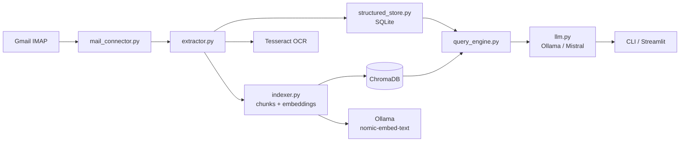

# Mail IA Agent (Gmail, local-first)

Ce projet Python indexe des emails Gmail et leurs pieces jointes pour permettre des recherches en langage naturel, en gardant les donnees en local.

## Architecture globale

L'architecture du projet suit un pipeline local de bout en bout. Le connecteur IMAP lit les mails Gmail et leurs metadonnees, puis le module d'extraction transforme le contenu des pieces jointes (PDF, DOCX, images OCR) en texte exploitable. Ce contenu est ensuite envoye dans deux couches complementaires: une couche structuree SQLite et une couche semantique vectorielle (ChromaDB, etape suivante).



SQLite joue le role de colonne vertebrale factuelle du systeme. La base stocke des informations explicites et verifiables comme la date, l'expediteur, le sujet, le corps normalise, les pieces jointes et, ensuite, les entites extraites (montants, personnes, themes). Cette couche permet des filtres exacts, des tris temporels, des agregations et des tableaux, ce qui est indispensable pour repondre de maniere fiable aux questions metier sans hallucination.

La couche vectorielle est utile pour la recherche de similarite semantique, mais elle ne remplace pas SQLite. Les deux couches sont combinees par le moteur de requete: SQLite apporte la precision structuree, Chroma apporte le rappel semantique, et le LLM formule la reponse finale uniquement a partir des resultats recuperes.

Le role de ChromaDB est donc de memoriser des vecteurs d'embeddings par morceaux de texte (chunks) pour retrouver des contenus proches en sens, meme quand les mots exacts ne correspondent pas. Cette capacite est essentielle pour des questions comme "prix du gateau chocolat" ou "interactions avec Nam", ou le vocabulaire varie d'un mail a l'autre.

Ollama est le moteur IA local du projet. Il fournit deux choses differentes mais complementaires: les embeddings via `nomic-embed-text` pour ChromaDB, et le modele de langage `mistral` pour rediger la reponse finale. Tesseract, lui, sert uniquement a faire l'OCR sur les images et les scans; sans lui, les documents photographies ou numerises ne peuvent pas etre transformes en texte exploitable.

En pratique, le flux complet est le suivant: Gmail IMAP alimente `mail_connector.py`, l'analyse de contenu passe par `extractor.py`, les faits sont persistes par `structured_store.py`, la recherche semantique est geree par `indexer.py`, puis `query_engine.py` orchestre les appels pour produire une reponse via `llm.py`, exposee ensuite dans la CLI et plus tard dans l'interface Streamlit.

## Prealables (a faire avant le clone)

### 1) Ollama + modeles

1. Installer Ollama (Windows): https://ollama.com/download
2. Verifier:

```powershell
ollama --version
```

3. Telecharger les modeles:

```powershell
ollama pull mistral
ollama pull nomic-embed-text
```

4. Tester:

```powershell
ollama run mistral "dis bonjour"
```

Ollama tourne en local sur http://localhost:11434.

### 2) Tesseract OCR (Windows)

1. Installer Tesseract (UB Mannheim): https://github.com/UB-Mannheim/tesseract/wiki
2. Pendant l'installation, ajouter la langue French.
3. Ajouter le dossier d'installation au PATH (souvent C:\Program Files\Tesseract-OCR).
4. Ouvrir un nouveau terminal puis verifier:

```powershell
tesseract --version
```

Si PATH n'est pas disponible, definir dans `.env`:

```env
TESSERACT_CMD=C:\Program Files\Tesseract-OCR\tesseract.exe
```

### 3) ChromaDB + embeddings (etape 5)

Il n'y a pas d'installeur systeme pour ChromaDB dans ce projet: la dependance Python est deja dans `requirements.txt`. En revanche, il faut bien avoir Ollama actif avec le modele d'embeddings `nomic-embed-text`, car Chroma stocke les vecteurs produits par ce modele.

Verification rapide:

```powershell
ollama list
```

Vous devez voir `nomic-embed-text:latest` dans la liste.

### 4) Ollama pour les reponses LLM (etapes 6-7)

Le modele de langage local utilise par le wrapper LLM est `mistral` par defaut. Il doit apparaitre dans `ollama list`, et le service Ollama doit rester actif pendant les tests du moteur de requete.

Verification rapide:

```powershell
ollama list
```

Vous devez voir `mistral:latest` dans la liste.

Regle generale d'execution:
- toutes les commandes de ce README doivent etre lancees dans l'environnement virtuel active (`.venv`).
- sur Windows, si besoin, utilisez explicitement `.\\.venv\\Scripts\\python.exe`.

Pourquoi installer Tesseract des le debut:
- l'etape 3 repose sur OCR (images/scans).
- sans Tesseract, le test OCR passe en `SKIP` et vous ne validez pas le round complet.
- l'installer avant le clone/les tests evite des allers-retours de configuration plus tard.

Etat actuel:
- setup du projet
- connexion IMAP Gmail
- commande CLI `index` pour afficher les 10 derniers mails de INBOX
- round 2: affichage de la taille du corps texte et du nombre de pieces jointes

## 0) Prérequis avant de cloner le repo

Logiciels a installer:
- Python 3.11+ (3.11 recommande)
- Git
- SQLite (CLI sqlite3 recommande pour verification locale)
- Tesseract OCR (pour l'etape OCR)
- Ollama (pour les etapes LLM/embeddings suivantes)

Verifications rapides:

```powershell
python --version
git --version
tesseract --version
sqlite3 --version
ollama --version
```

Parametrages Gmail a faire avant les tests IMAP:
1. Activer la validation en 2 etapes sur le compte Google.
2. Generer un mot de passe d'application Google.
3. Activer IMAP dans Gmail (Parametres > Transfert et POP/IMAP).

Important:
- Si `tesseract --version` echoue, ajoutez Tesseract au `PATH`.
- Alternative: renseigner `TESSERACT_CMD` dans `.env`.

## 1) Cloner le projet depuis GitHub

```bash
git clone https://github.com/PascalDuval/IAmail.git
cd IAmail
```

## 2) Creer un environnement Python

Windows (PowerShell):

```powershell
python -m venv .venv
.\.venv\Scripts\Activate.ps1
```

macOS / Linux:

```bash
python3 -m venv .venv
source .venv/bin/activate
```

## 3) Installer les dependances

Activez d'abord l'environnement virtuel (section 2), puis executez:

```bash
pip install -r requirements.txt
```

## 4) Configurer Gmail via mot de passe d'application

1. Activez la validation en 2 etapes du compte Google.
2. Generez un mot de passe d'application Gmail.
3. Activez IMAP dans Gmail (Parametres > Transfert et POP/IMAP).
4. Copiez `.env.example` vers `.env` puis renseignez vos valeurs.

Exemple:

```env
GMAIL_ADDRESS=votre_mail@gmail.com
GMAIL_APP_PASSWORD=votre_mot_de_passe_application
IMAP_HOST=imap.gmail.com
IMAP_PORT=993
IMAP_SSL=true
IMAP_SSL_VERIFY=true
IMAP_FOLDER=INBOX
LLM_MODEL=mistral
OLLAMA_HOST=http://localhost:11434
EMBEDDING_MODEL=nomic-embed-text
```

Variables prises en charge:
- `GMAIL_ADDRESS`: adresse Gmail
- `GMAIL_APP_PASSWORD`: mot de passe d'application Google
- `IMAP_HOST`: serveur IMAP (Gmail: `imap.gmail.com`)
- `IMAP_PORT`: port IMAP (Gmail SSL: `993`)
- `IMAP_SSL`: `true` ou `false`
- `IMAP_SSL_VERIFY`: `true` ou `false` (laisser `true` sauf diagnostic local)
- `IMAP_FOLDER`: dossier a lire (par defaut `INBOX`)
- `LLM_MODEL`: modele de langage utilise pour la synthese des reponses (par defaut `mistral`)
- `OLLAMA_HOST`: endpoint Ollama local (par defaut `http://localhost:11434`)
- `EMBEDDING_MODEL`: modele d'embeddings utilise par Chroma (par defaut `nomic-embed-text`)

Important:
- ne committez jamais `.env`
- ne partagez jamais votre mot de passe d'application

## 5) Tests progressifs (rounds)

Important pour tous les rounds:
- lancer les commandes dans l'environnement virtuel active (`.venv`),
- ou utiliser le binaire explicite: `.\.venv\Scripts\python.exe ...`

### 5.1) Verifier la connexion IMAP (Round 1 / etape 1)

Commande de test:

```bash
python.exe -m src.cli index
```

Sortie attendue:
- tableau des derniers mails avec date, expediteur et objet

Exemple valide (Round 1):

```text
┌──────────────────┬───────────────────────────────────────────────────────────┬─────────────────────────────────────────────────────────────────────────────────────────────────────────────────────────┐
│ Date             │ Expediteur                                                │ Objet                                                                                                                   │
├──────────────────┼───────────────────────────────────────────────────────────┼─────────────────────────────────────────────────────────────────────────────────────────────────────────────────────────┤
│ 2026-07-12 11:34 │ Google <no-reply@accounts.google.com>                     │ Alerte de securite                                                                                                      │
│ 2026-07-12 11:17 │ Leader <noreply@communities.kajabimail.com>               │ Leader is live on SAATM Virtual Academy | July 12                                                                       │
│ 2026-07-12 11:01 │ Agone <editions@agone.org>                                │ Un 14 juillet, il y a 237 ans [LettrInfo 26-XXI]                                                                        │
│ 2026-07-12 10:50 │ Votre alerte Cadremploi <offres@alertes.cadremploi.fr>    │ 1 offre a ne rater sous aucun pretexte                                                                                  │
│ 2026-07-12 10:43 │ Alertes Google Scholar <scholaralerts-noreply@google.com> │ Nietzsche - de nouveaux resultats sont disponibles                                                                      │
│ 2026-07-12 10:43 │ Alertes Google Scholar <scholaralerts-noreply@google.com> │ "stanley cavell" - de nouveaux resultats sont disponibles                                                               │
│ 2026-07-12 10:15 │ Indeed <donotreply@match.indeed.com>                      │ Chef de Projet Supervision Transport Supervision Aide a l'Exploitation (SAE) MAV - F/H (D&I/TSI) - RATP EPIC          │
│ 2026-07-12 10:01 │ Indeed <donotreply@match.indeed.com>                      │ Responsable maitrise d'oeuvre outillage, telemaintenance et supervision pour le Grand Paris - F/H (DSI/TSI) - RATP EPIC │
│ 2026-07-12 09:49 │ Alertes LinkedIn Jobs <jobalerts-noreply@linkedin.com>    │ Blockchain / Cryptocurrency Project Lead [Full Stack and AWS] chez OREBiT                                               │
│ 2026-07-12 09:49 │ Alertes LinkedIn Jobs <jobalerts-noreply@linkedin.com>    │ Alternant(e) REDACTEUR ET CREATEUR DE CONTENUS VIDEOS chez Cite internationale universitaire de Paris                  │
└──────────────────┴───────────────────────────────────────────────────────────┴─────────────────────────────────────────────────────────────────────────────────────────────────────────────────────────┘
```

### 5.2) Etape 2 / Round 2 - corps texte + pieces jointes

Objectif:
- `index` recupere aussi le corps texte (parties `text/plain`) et les pieces jointes de base
- la table affiche deux colonnes supplementaires:
  - `Corps (car)` = taille en caracteres du corps texte extrait
  - `PJ` = nombre de pieces jointes detectees

Commande de test Round 2 (20 derniers mails):

```bash
python.exe -m src.cli index --limit 20
```

Exemple de sortie Round 2:

```text
┌──────────────────┬───────────────────────────────────────────────────────────┬─────────────┬────┬─────────────────────────────────────────────────────────────────────────────────────────────────────────────────────────────┐
│ Date             │ Expediteur                                                │ Corps (car) │ PJ │ Objet                                                                                                                       │
├──────────────────┼───────────────────────────────────────────────────────────┼─────────────┼────┼─────────────────────────────────────────────────────────────────────────────────────────────────────────────────────────────┤
│ 2026-07-12 11:34 │ Google <no-reply@accounts.google.com>                     │         809 │  0 │ Alerte de securite                                                                                                          │
│ 2026-07-12 11:17 │ Leader <noreply@communities.kajabimail.com>               │        3167 │  0 │ Leader is live on SAATM Virtual Academy | July 12                                                                           │
│ 2026-07-12 11:01 │ Agone <editions@agone.org>                                │       11809 │  0 │ Un 14 juillet, il y a 237 ans [LettrInfo 26-XXI]                                                                            │
│ 2026-07-12 10:50 │ Votre alerte Cadremploi <offres@alertes.cadremploi.fr>    │           0 │  0 │ 1 offre a ne rater sous aucun pretexte                                                                                      │
│ 2026-07-12 10:43 │ Alertes Google Scholar <scholaralerts-noreply@google.com> │           0 │  0 │ Nietzsche - de nouveaux resultats sont disponibles                                                                          │
│ 2026-07-12 10:43 │ Alertes Google Scholar <scholaralerts-noreply@google.com> │           0 │  0 │ "stanley cavell" - de nouveaux resultats sont disponibles                                                                   │
│ 2026-07-12 10:15 │ Indeed <donotreply@match.indeed.com>                      │        7877 │  0 │ Chef de Projet Supervision Transport Supervision Aide a l'Exploitation (SAE) MAV - F/H (D&I/TSI) - RATP EPIC                │
│ 2026-07-12 10:01 │ Indeed <donotreply@match.indeed.com>                      │        8051 │  0 │ Responsable maitrise d'oeuvre outillage, telemaintenance et supervision pour le Grand Paris - F/H (DSI/TSI) - RATP EPIC     │
│ 2026-07-12 09:49 │ Alertes LinkedIn Jobs <jobalerts-noreply@linkedin.com>    │       10065 │  0 │ Blockchain / Cryptocurrency Project Lead [Full Stack and AWS] chez OREBiT                                                   │
│ 2026-07-12 09:49 │ Alertes LinkedIn Jobs <jobalerts-noreply@linkedin.com>    │        5227 │  0 │ Alternant(e) REDACTEUR ET CREATEUR DE CONTENUS VIDEOS chez Cite internationale universitaire de Paris                       │
│ 2026-07-12 09:49 │ Alertes LinkedIn Jobs <jobalerts-noreply@linkedin.com>    │        9877 │  0 │ CNIL recrute a Ville de Paris                                                                                               │
│ 2026-07-12 09:49 │ Alertes LinkedIn Jobs <jobalerts-noreply@linkedin.com>    │        9975 │  0 │ Artificial Intelligence Engineer chez Reply                                                                                 │
│ 2026-07-12 09:49 │ Alertes LinkedIn Jobs <jobalerts-noreply@linkedin.com>    │       10030 │  0 │ Artificial Intelligence Engineer chez Reply                                                                                 │
│ 2026-07-12 09:46 │ Archana sur Facebook <friendupdates@facebookmail.com>     │         853 │  0 │ Pour vous : votre ami(e) Archana Pandey a partage la publication de Rishibha Tiwari                                         │
│ 2026-07-12 09:42 │ Indeed <donotreply@match.indeed.com>                      │        7684 │  0 │ Responsable des Systemes d'Information H/F - remplacement - GROUPE ESRA                                                     │
│ 2026-07-12 09:36 │ Indeed <donotreply@match.indeed.com>                      │        7432 │  0 │ Conseil en Reglementation ESP/ESPN F/H - EDF                                                                                │
│ 2026-07-12 09:30 │ AOC (Analyse Opinion Critique) <contact@aoc.media>        │        1408 │  0 │ 6 mois pour 1EUR, plus que quelques jours...                                                                                │
│ 2026-07-12 09:05 │ Philosophie magazine <infolettres@redaction.philomag.com> │       16353 │  0 │ Marine Le Pen hors surveillance, la regle d'or du football et le cerveau de Putnam... La semaine de "Philosophie magazine" │
│ 2026-07-12 08:06 │ Indeed <donotreply@match.indeed.com>                      │        7449 │  0 │ Chef de Projet CVC - Macro-Lot - H/F - NEO2 Consultant                                                                      │
│ 2026-07-12 07:49 │ Alertes LinkedIn Jobs <jobalerts-noreply@linkedin.com>    │        9867 │  0 │ CNIL recrute a France                                                                                                       │
└──────────────────┴───────────────────────────────────────────────────────────┴─────────────┴────┴─────────────────────────────────────────────────────────────────────────────────────────────────────────────────────────────┘
```

### 5.3) Etape 3 - extraction PDF / DOCX / OCR

Commande de test:

```bash
python.exe tests/run_extractor_examples.py
```

Sortie de reference:

```text
=== Round 3: extraction PDF / DOCX / OCR ===
[OK] DOCX: contient 'Bonjour depuis DOCX'
[OK] PDF: contient 'Bonjour PDF exemple'
[OK] OCR: contient 'OCR'
Round 3 OK: extraction PDF/DOCX/OCR validee.
```

Pourquoi le `SKIP` OCR peut apparaitre:
- Tesseract n'est pas installe sur la machine
- Tesseract est installe, mais son executable n'est pas dans le `PATH`
- le chemin n'est pas renseigne dans la variable `TESSERACT_CMD`

Installation Tesseract (Windows):
1. Installer Tesseract (par exemple UB Mannheim).
2. Verifier dans un terminal:

```powershell
tesseract --version
```

3. Si la commande n'est pas trouvee, ajouter le dossier d'installation de Tesseract au `PATH`.
4. Alternative locale projet: renseigner `TESSERACT_CMD` dans `.env`, par exemple:

```env
TESSERACT_CMD=C:\Program Files\Tesseract-OCR\tesseract.exe
```

### 5.4) Etape 4 - stockage structure SQLite

Objectif:
- creer un schema SQLite (`mails`, `attachments`, `entities`)
- valider insertion et lecture

Commande de test:

```bash
python.exe tests/run_structured_store_examples.py
```

Sortie attendue (exemple):

```text
[OK] schema contient mails
[OK] schema contient attachments
[OK] schema contient entities
[OK] lecture recent mails non vide
[OK] lecture sujet correct
[OK] lecture uid correct
Etape 4 OK: schema + insertion + lecture SQLite valides.
```

### 5.5) Etape 5 - indexation semantique Chroma

Objectif:
- decouper le texte en chunks
- generer les embeddings via Ollama (`nomic-embed-text`)
- persister les chunks dans ChromaDB
- verifier une requete semantique simple

Commande de test:

```bash
python.exe tests/run_indexer_examples.py
```

Sortie attendue (exemple):

```text
[OK] documents indexes
[OK] chunks persistes dans Chroma
[OK] requete semantique retourne des resultats
[OK] top resultat semantiquement pertinent
Etape 5 OK: chunking + embeddings + persistance Chroma + requete semantique valides.
```

### 5.6) Étapes 6-7 - wrapper LLM + moteur de requête

Objectif:
- interroger la couche structuree SQLite et la couche semantique Chroma en meme temps
- construire un contexte a partir des resultats recuperes
- faire formuler la reponse finale par le LLM local Ollama (`mistral`)

Commande de test:

```bash
python.exe tests/run_query_engine_examples.py
```

Sortie attendue (exemple):

```text
[OK] mails indexes
[OK] chunks indexes
[OK] hits structurels disponibles
[OK] hits semantiques disponibles
[OK] reponse non vide
[OK] reponse pertinente
--- Reponse ---
Etape 6-7 OK: wrapper LLM + query engine valides.
```

L'idée de cette étape est simple: SQLite apporte les faits précis, Chroma apporte le rapprochement sémantique, et Ollama rédige la réponse finale à partir de ces éléments. Tesseract, de son côté, ne sert qu'à l'OCR des images et des documents scannés.

## 6) Arborescence

```text
.
├── README.md
├── requirements.txt
├── .env.example
├── .gitignore
├── config/
│   └── settings.yaml
├── src/
│   ├── __init__.py
│   ├── mail_connector.py
│   ├── extractor.py
│   ├── indexer.py
│   ├── structured_store.py
│   ├── llm.py
│   ├── query_engine.py
│   ├── actions.py
│   └── cli.py
├── app_streamlit.py
├── data/
└── tests/
```

## 7) Confidentialite et donnees sensibles

Le projet manipule potentiellement des donnees personnelles (emails, finances, documents). L'objectif est un fonctionnement local-first (modele local via Ollama), sans envoi externe des contenus mail.
